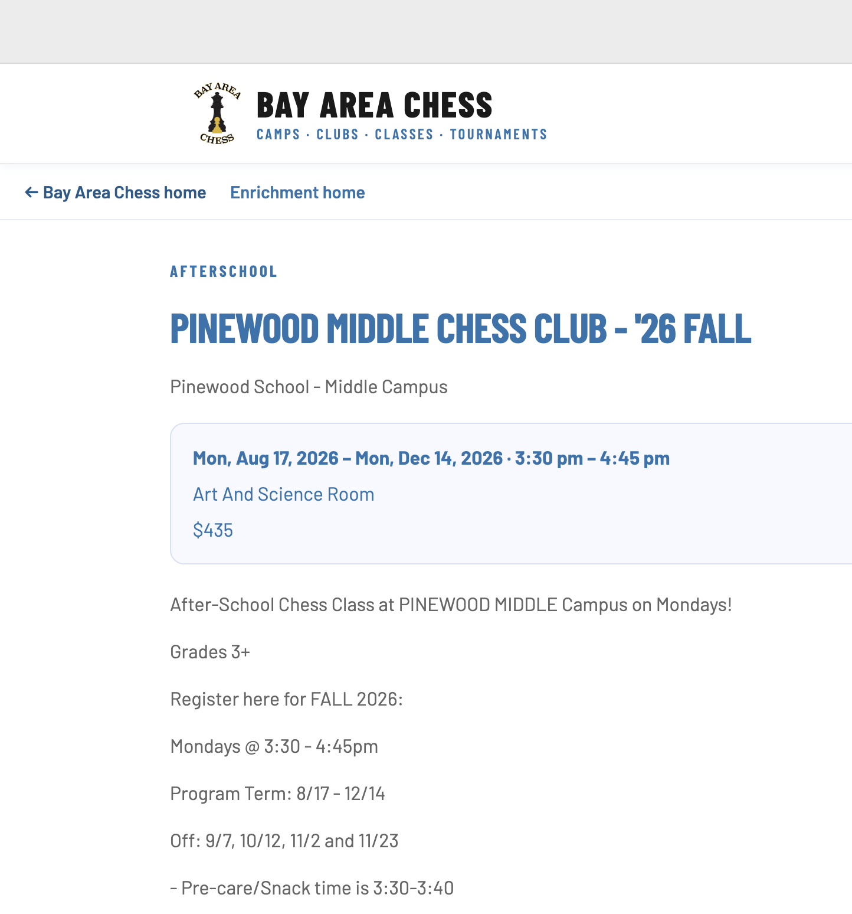
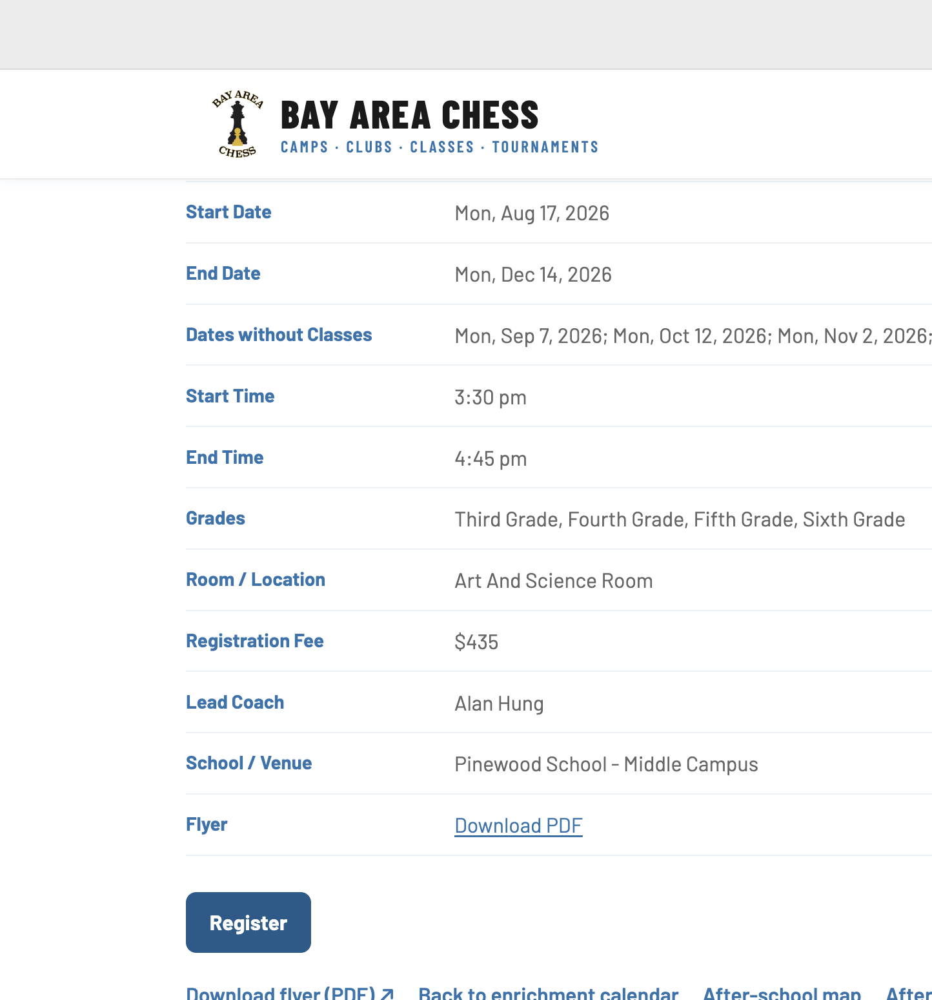
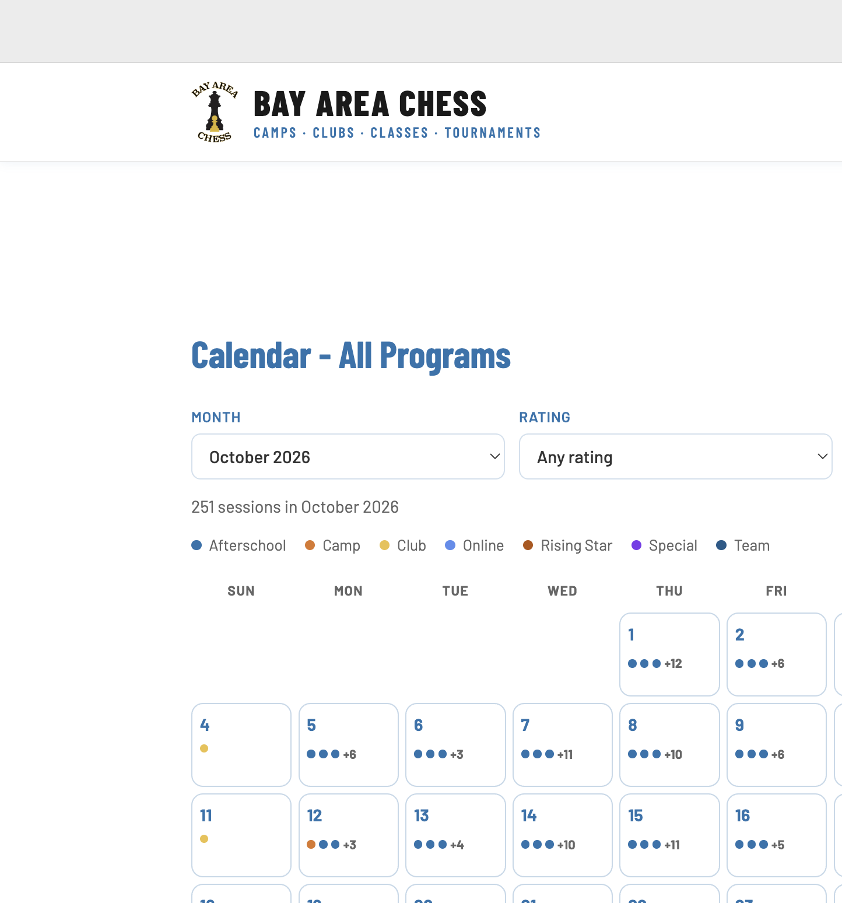
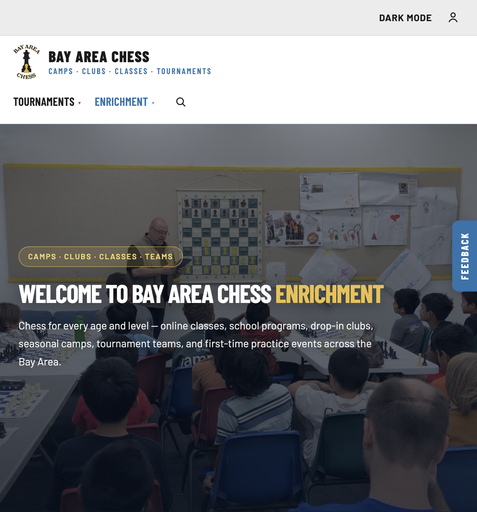
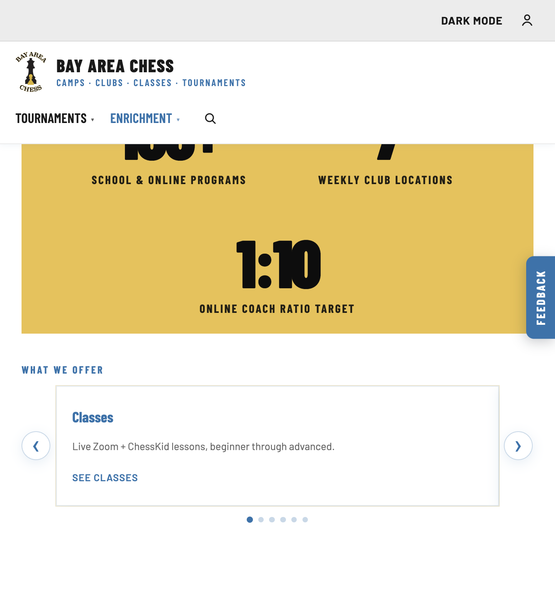
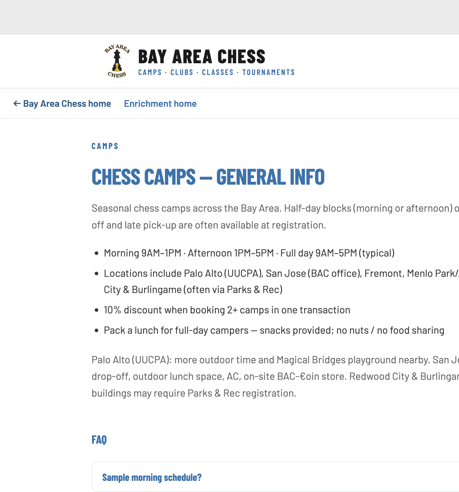
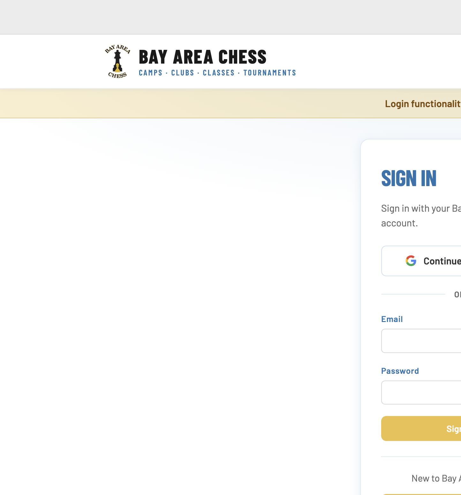

## Summary

Enrichment calendar destinations that used to open on enrichment.bayareachess.com now open as first-class pages on this site. Registration CTAs route to local login, a site-wide Feedback tab makes it easy to share input, and several enrichment surfaces get clearer layout and dark-mode polish.

## Highlights

### Local enrichment program pages
- Calendar sessions that previously linked out to enrichment.bayareachess.com now resolve to local routes under `/enrichment/...` (plus related `/camp/...` and `/event/...` pages where applicable)
- Program pages mirror live content: schedule, fees, grades, coach, room/venue, flyer links, and full description
- Google Docs and Homeroom destinations stay external — only enrichment.bayareachess.com program URLs are mirrored locally
- **Register** on program pages goes to `/login` on this site (not the legacy enrichment host)

### Calendar stays on-site
- Day/session links in **Calendar – All Programs** prefer the new local pages
- Parents can browse the calendar and open program detail without leaving the new site

### Feedback tab
- Persistent **Feedback** tab on the right edge of every page
- Opens the BAC feedback form (`forms.gle/A55yks9JYMKLEa4WA`) in a new tab

### Offerings & dark-mode polish
- Home/enrichment **What we offer** layout updated for a clearer six-item presentation (3-across on wide viewports)
- Featured activity tiles keep readable hover contrast in dark mode (tile surface darkens with the theme instead of washing out)

### Camps copy cleanup
- Removed camps map hint and strategy-game note clutter from the camps experience
- Camps-by-city remains available from the camps overview; the unused camps-menu page/links are gone

### Login readiness banner
- Login page shows a clear notice: **Login functionality is not ready yet.**
- Sign-in UI remains visible so the flow can be finished without surprising visitors

## Upgrade checklist

1. Pull `v2.2.0` (`git pull` / deploy as usual)
2. Restart the API so new enrichment data modules load (`enrichmentMirroredPages`, `enrichmentProgramPages`, calendar/search wiring)
3. Smoke-test:
   - `/enrichment` → calendar session → local program page loads with full detail
   - Program **Register** → `/login`
   - Feedback tab opens the Google Form in a new tab
   - `/login` shows the readiness banner
   - Camps overview no longer shows the old map/strategy hint copy
   - Dark mode: featured tiles remain readable on hover

## Not included in this release

- Homeroom / Google Docs destinations (intentionally still external)
- Full production-ready login (banner remains until auth is ready for parents)
- Leaderboard cache churn / local `.tmp` crawl artifacts (not shipped)
